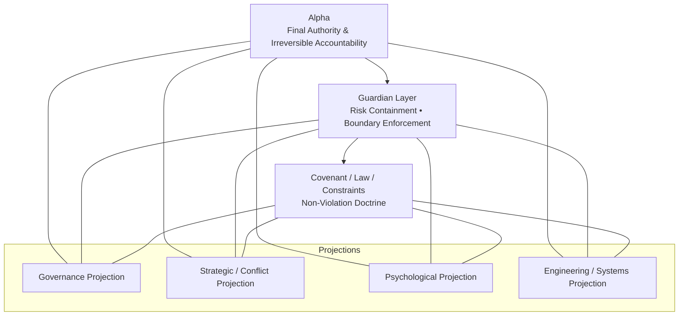

# 🛡 FDE Battlefield Sovereign Architecture™
### Alpha-Centric, Risk-Aware Decision Architecture

**Sovereign Creator:** Yinan Yang  
**Architecture Origin:** Alpha-Centric Sovereign Design

---

> A sovereign, alpha-centric decision architecture for adversarial,
> high-uncertainty, and regime-unstable environments.

> **FDE is a sovereign, cross-domain decision architecture — not a single-purpose
financial, engineering, or tactical tool.**
>
> The implementations, metaphors, strategies, and system examples contained in this
repository represent **domain-specific projections** of the architecture,
rather than the architecture’s canonical form itself.

---

## 🎯 Core Principle

**Alpha is the permanent and final decision authority.**  
All other personas function as **auxiliary stabilization and enforcement layers**
operating strictly within Alpha-defined laws, constraints, and boundaries.

This architecture is designed for environments characterized by:

- adversarial pressure
- structural uncertainty and deception
- volatility, regime shifts, and constraint violations

Its purpose is **long-horizon survivability, bounded adaptation, and sovereign control**.

## Intellectual Property & Ownership Notice

This repository and all associated architecture, design patterns, terminology, and implementation
are the original work of **Yinan Yang**.

All rights reserved unless explicitly stated otherwise.
Unauthorized use, reproduction, or derivative work is prohibited.

Any experiment that bypasses canonicalization
is considered invalid and non-existent.

任何绕过 Canonicalization 的实验，  
在 FDE 体系中视为未发生。
