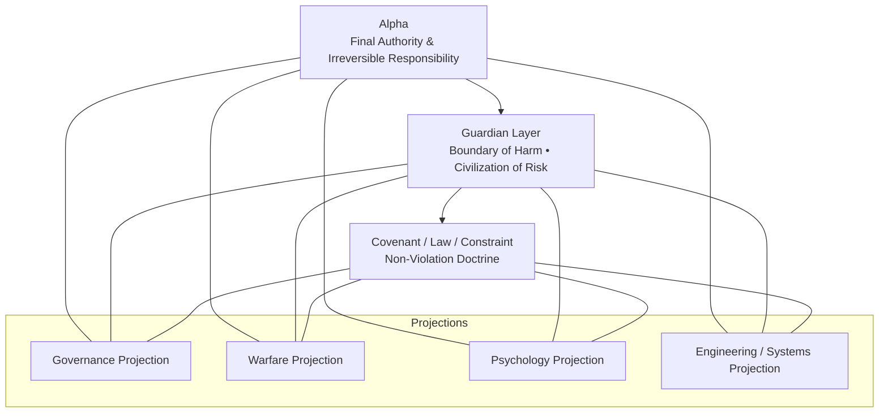

# 🛡 FDE Battlefield Sovereign Architecture™
### Alpha-Centric Risk-Aware Intelligence System

**Sovereign Creator: YINAN YANG — ALPHA ORIGIN**

---

> **FDE 是一套主权式跨领域存在结构（Sovereign Architecture），而不仅是金融或工程工具。**  
> 本仓库中的实现、比喻、策略与系统示例，均属于其在不同领域中的 **投影场景（projection）**，而非本体本身。

## 🎯 Principle

**Alpha is the permanent and final sovereign decision authority.**  
All other personas operate as **auxiliary stability instruments**
under Alpha-defined laws and boundaries.

This system is designed for:

- adversarial environments
- structural deception
- volatility and regime instability

Its purpose is **endurance, survival, and disciplined sovereignty**.

